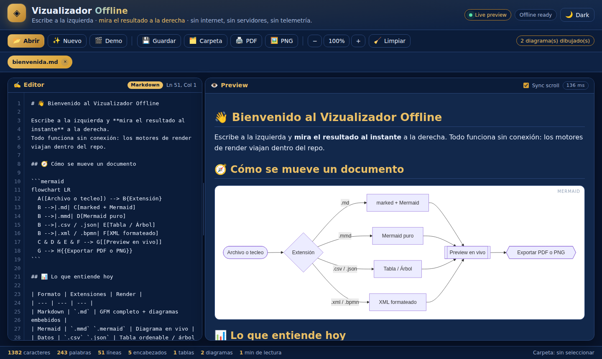
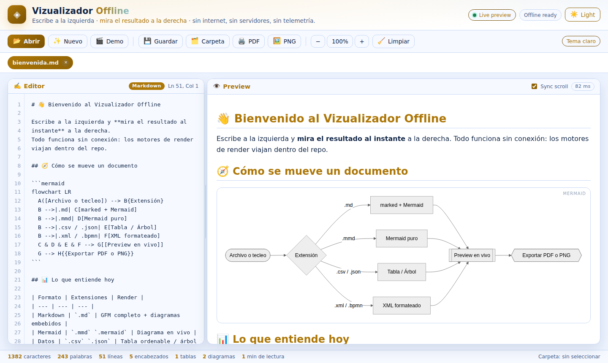
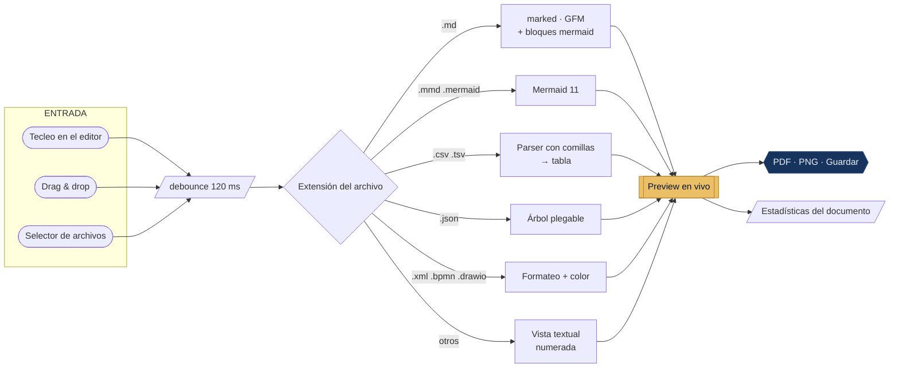
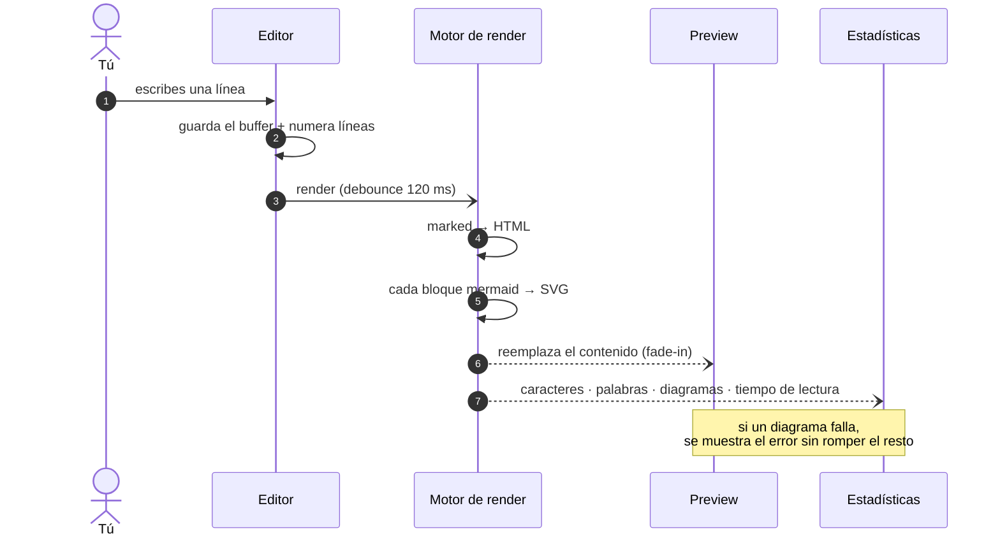
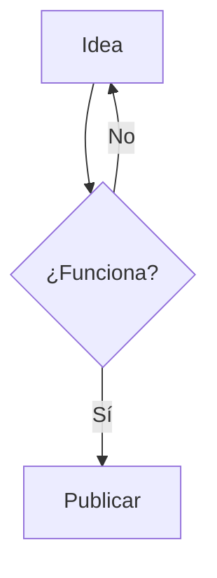

<div align="center">



<br />

**Escribe a la izquierda · mira el resultado a la derecha · sin internet, sin servidores, sin telemetría.**

[](LICENSE)
[](#-instalar-como-app)
[](#-cómo-funciona-por-dentro)
[](#-arrancar-en-15-segundos)
[](https://mermaid.js.org)

### 🔗 Repositorio · [github.com/oprbguitar/vizualizador](https://github.com/oprbguitar/vizualizador)

</div>

---

## ✨ Qué es esto

Un **editor Markdown con live preview** —al estilo *markdownlivepreview*— que además dibuja
**diagramas Mermaid en vivo** y sabe leer CSV, JSON y XML. Todo cabe en una carpeta:
abres `index.html` y funciona. Sin `npm install`, sin bundler, sin backend, sin cuenta.

> [!TIP]
> Los motores de render (`marked` y `mermaid`) viajan **dentro del repositorio**.
> Por eso el avión, el sótano y el aula sin wifi son escenarios perfectamente válidos.

<div align="center">

|  |  |
| :-- | :-- |
| ⌨️ **Escribes** | El editor cuenta líneas, palabras, encabezados y diagramas al vuelo |
| ⚡ **Se renderiza** | Debounce de 120 ms: el preview te sigue sin parpadear |
| 🎨 **Lo ves bonito** | Tema oscuro/claro, zoom, scroll sincronizado, paneles redimensionables |
| 📤 **Te lo llevas** | PDF por impresión, PNG rasterizado del diagrama, o guardado directo en tu carpeta |

</div>

---

## 🖼️ Así se ve

<div align="center">



<sub>Tema oscuro · Markdown con diagrama Mermaid renderizado en vivo</sub>

<br /><br />



<sub>Tema claro · el mismo documento, un clic después (o `Ctrl + D`)</sub>

</div>

---

## 🚀 Arrancar en 15 segundos

```bash
git clone https://github.com/oprbguitar/vizualizador.git
cd vizualizador
python3 -m http.server 8080
```

Abre **<http://localhost:8080>** en Chrome o Edge. Listo.

<details>
<summary><b>¿Sin Python a mano?</b> Otras formas de servirlo</summary>

<br />

```bash
npx serve .          # Node
php -S localhost:8080 # PHP
```

También puedes abrir `index.html` con doble clic: todo funciona **excepto**
el Service Worker (necesita `http://` o `https://`, no `file://`).

</details>

---

## 🎛️ Panel de mandos

<div align="center">

| Botón | Qué hace | Atajo |
| :-: | :-- | :-: |
| 📂 **Abrir** | Carga uno o varios archivos (o arrástralos sobre la ventana) | — |
| ✨ **Nuevo** | Crea una pestaña en blanco | — |
| 🎬 **Demo** | Documento de bienvenida con diagramas y tablas de ejemplo | — |
| 💾 **Guardar** | Escribe en tu carpeta elegida, o descarga el archivo | `Ctrl + S` |
| 🗂️ **Carpeta** | Elige destino con la *File System Access API* | — |
| 🖨️ **PDF** | Exporta el preview limpio mediante la impresión del navegador | `Ctrl + P` |
| 🖼️ **PNG** | Rasteriza el diagrama Mermaid a PNG 2× (o el texto, si no hay diagrama) | — |
| 🌙 **Tema** | Alterna oscuro / claro (y reconstruye los diagramas) | `Ctrl + D` |
| 🔍 **Zoom** | Acerca o aleja solo el preview | `Ctrl + Shift + Z` para restablecer |
| 🧹 **Limpiar** | Cierra todas las pestañas | — |

</div>

---

## 🧠 Cómo funciona por dentro



El ciclo completo de una pulsación de tecla:



---

## 📚 Formatos soportados

<details open>
<summary><b>Con render gráfico</b></summary>

<br />

| Extensión | Qué obtienes |
| :-- | :-- |
| `.md` `.markdown` | Markdown GFM completo: tablas, listas, citas, código, enlaces… y **diagramas Mermaid embebidos** |
| `.mmd` `.mermaid` | El diagrama a pantalla completa, redibujado mientras escribes |
| `.csv` `.tsv` | Tabla con detección automática de delimitador (`,` `;` `tab` `\|`) y soporte de comillas |
| `.json` | Árbol plegable con colores por tipo y recuento de nodos |
| `.xml` `.bpmn` `.drawio` | XML indentado, con etiquetas y atributos coloreados |

</details>

<details>
<summary><b>Con vista textual numerada</b></summary>

<br />

`.puml` · `.c4` · `.erd` · `.sql` · `.zen` · `.mm` · `.xmind` · `.mpp` · `.vsdx` · `.txt`

Estos formatos se abren como texto legible con numeración de líneas. Los binarios
propietarios (`.fig`, `.sketch`, `.psd`, `.vsdx` comprimido…) **no** se decodifican:
el objetivo es no arrastrar dependencias pesadas y seguir funcionando sin conexión.

</details>

<details>
<summary><b>Sintaxis Mermaid que puedes usar</b></summary>

<br />

Mermaid 11 viaja completo en el repo, así que tienes `flowchart`, `sequenceDiagram`,
`classDiagram`, `stateDiagram`, `erDiagram`, `journey`, `gantt`, `pie`, `mindmap`,
`timeline`, `quadrantChart`, `gitGraph` y más. Dentro de un `.md` basta con:

````markdown

````

</details>

---

## 🗂️ Estructura del proyecto

```text
vizualizador/
├── index.html              → la app entera (un solo documento)
├── manifest.json           → metadatos PWA
├── sw.js                   → Service Worker (cache-first, v5)
├── LICENSE                 → MIT
└── assets/
    ├── css/styles.css      → paleta azul + dorado, dark/light, animaciones
    ├── js/app.js           → editor, render, estadísticas, exportación
    ├── icons/icon.svg      → icono de la PWA
    ├── img/                → banner animado y capturas
    └── vendor/
        ├── marked.min.js   → Markdown (MIT)
        └── mermaid.min.js  → diagramas (MIT)
```

---

## 📱 Instalar como app

1. Sirve el proyecto por `http://` o `https://` (paso anterior).
2. En Chrome/Edge, pulsa el icono **Instalar** de la barra de direcciones.
3. Se abre en ventana propia y, gracias al Service Worker, **arranca sin red**.

> [!NOTE]
> La *File System Access API* (botón **Carpeta**) solo existe en Chrome y Edge de
> escritorio. En el resto de navegadores, **Guardar** descarga el archivo — mismo
> resultado, un clic más.

---

## 🔒 Privacidad

Nada viaja a ningún sitio. No hay peticiones de red, ni analítica, ni CDN externo.
Tus documentos viven en la memoria del navegador y, si no los cierras, en el
`localStorage` de tu propio equipo para que la sesión sobreviva a un refresco.

---

## 🗺️ Roadmap

- [x] Editor + preview en paralelo con scroll sincronizado
- [x] Mermaid en vivo dentro de Markdown y en archivos `.mmd`
- [x] Tema oscuro/claro persistente
- [x] Pestañas multiarchivo y sesión restaurable
- [x] Exportación PDF y PNG (rasterizado real del SVG)
- [ ] Resaltado de sintaxis dentro del editor
- [ ] Índice navegable de encabezados
- [ ] Exportar a HTML autocontenido

¿Se te ocurre algo más? Abre un
[issue](https://github.com/oprbguitar/vizualizador/issues) o manda un
[pull request](https://github.com/oprbguitar/vizualizador/pulls).

---

## 📄 Licencia

Publicado bajo la **[Licencia MIT](LICENSE)**: úsalo, modifícalo, véndelo si quieres;
solo conserva el aviso de copyright. Las librerías incluidas en `assets/vendor/`
([marked](https://github.com/markedjs/marked) y
[mermaid](https://github.com/mermaid-js/mermaid)) también son MIT.

<div align="center">

<br />

**⭐ Si te resulta útil, deja una estrella en
[github.com/oprbguitar/vizualizador](https://github.com/oprbguitar/vizualizador)**

<sub>Hecho con HTML, CSS y JavaScript a secas. Ni un solo paquete que instalar.</sub>

</div>
