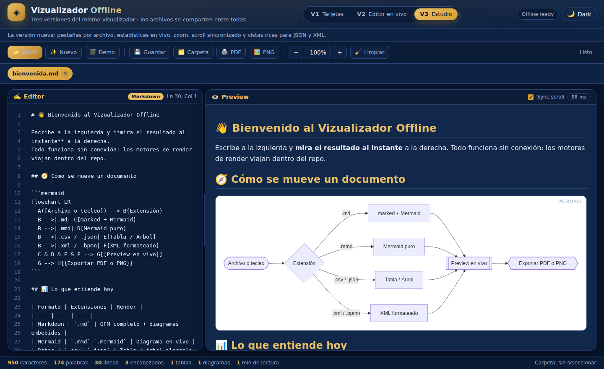
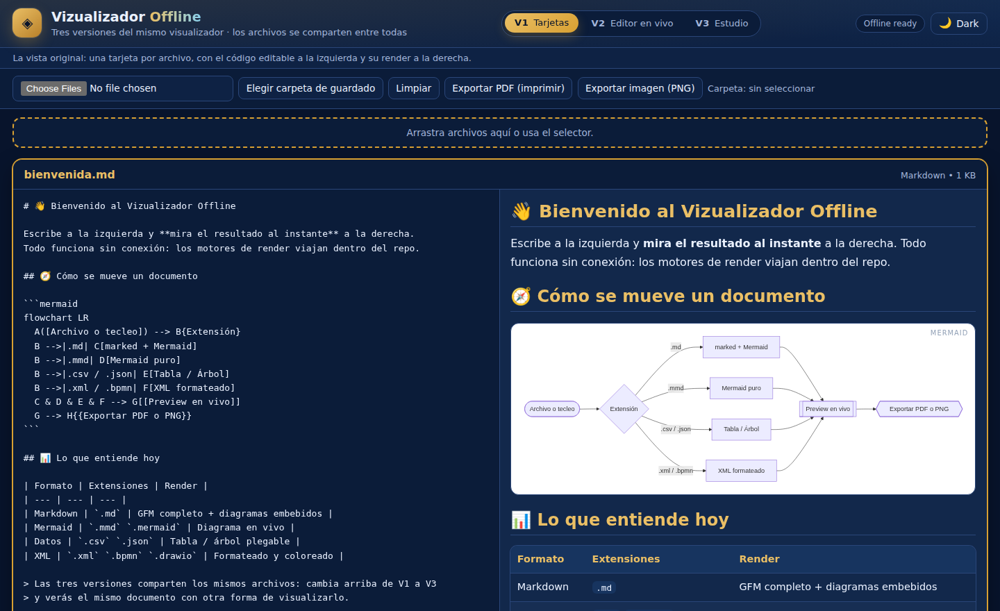
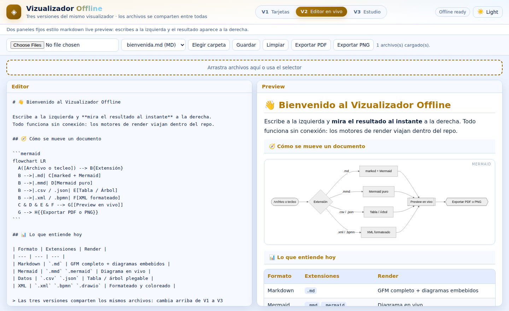
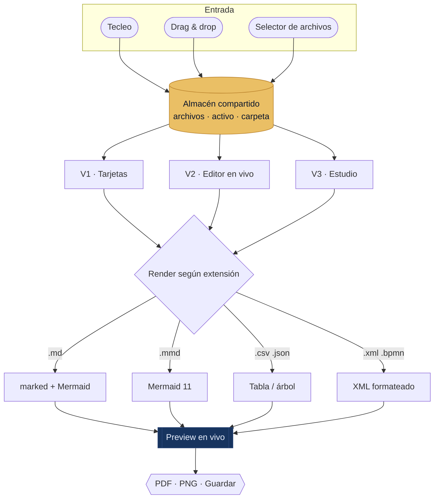
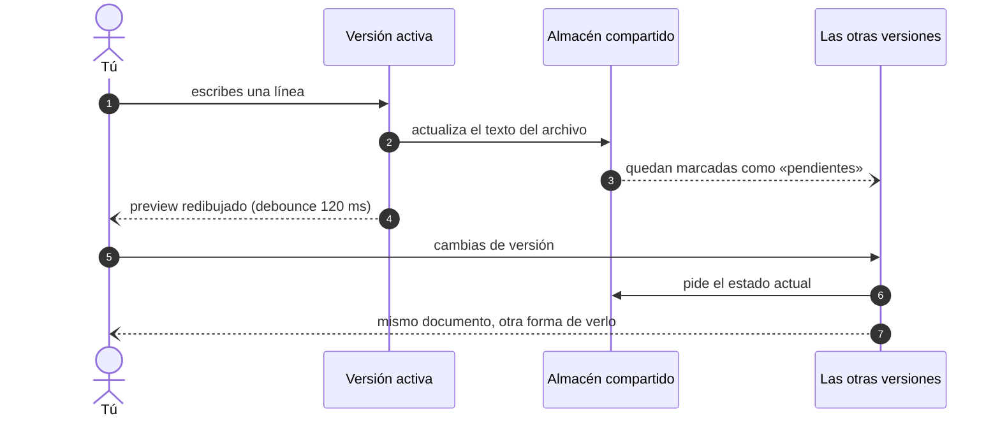

<div align="center">


<br />

**Tres formas de visualizar el mismo archivo · un solo repositorio · cero conexión**

[](https://oprbguitar.github.io/vizualizador/)
[](LICENSE)
[](#-nota-instalar-como-app-de-chrome)
[](#-cómo-funciona-por-dentro)
[](#-ejecutar)
[](https://mermaid.js.org)

### 🌐 Demo en vivo · **[oprbguitar.github.io/vizualizador](https://oprbguitar.github.io/vizualizador/)**

### 🔗 Repositorio · [github.com/oprbguitar/vizualizador](https://github.com/oprbguitar/vizualizador)

</div>

---

## ✨ Qué es esto

Aplicación web local (PWA) para Chrome con soporte offline para cargar archivos de
diagramas, ver **raw + preview en paralelo**, y exportar a PDF/PNG.

Lo que empezó como una vista de tarjetas creció hasta tener **tres versiones de
visualización**. En lugar de sustituir una por otra, **conviven las tres**: un
conmutador en la cabecera cambia la forma de ver, y **los archivos abiertos se
comparten entre ellas**. Editas en V3, cambias a V1 y ves el mismo documento con
otra piel.

<div align="center">

| Versión | Cómo visualiza | Para qué es buena |
| :-- | :-- | :-- |
| **V1 · Tarjetas** | Una tarjeta por archivo: código editable a la izquierda, render a la derecha | Comparar varios archivos de un vistazo |
| **V2 · Editor en vivo** | Dos paneles fijos + selector de archivo activo | Escribir concentrado en un solo documento |
| **V3 · Estudio** | Pestañas, estadísticas, zoom, scroll sincronizado, splitter | Trabajar en serio: medir, ajustar y exportar |

</div>

> [!TIP]
> `Alt + 1`, `Alt + 2` y `Alt + 3` saltan entre versiones. La elección se recuerda
> para la próxima visita, igual que el tema y los archivos abiertos.

---

## 🖼️ Las tres versiones

<div align="center">



<sub><b>V3 · Estudio</b> — pestañas por archivo, estadísticas en vivo, zoom y scroll sincronizado</sub>

<br /><br />



<sub><b>V1 · Tarjetas</b> — la vista original, tal como funcionaba: raw + preview en paralelo por archivo</sub>

<br /><br />



<sub><b>V2 · Editor en vivo</b> — dos paneles fijos, aquí en tema claro (`Ctrl + D`)</sub>

</div>

---

## 🧭 Qué funciona

- Vista paralela por archivo: **código a la izquierda + visualizador a la derecha**.
- Drag & drop y selector de archivos.
- Live preview Mermaid para `.mmd`, `.mermaid` y bloques Mermaid dentro de `.md`.
- Preview para `.csv`, `.json`, `.xml`, `.drawio`, `.bpmn` y textual para otros formatos.
- Exportar PDF (impresión) y PNG.
- Guardado en carpeta elegida en Chrome (File System Access API).
- Funciona offline con Service Worker.
- **Los tres modos comparten el mismo almacén**: abres una vez, ves de tres maneras.

---

## 📚 Soporte implementado

Se priorizaron formatos realistas sin librerías externas, para garantizar uso offline:

- Texto/diagramas (preview textual): `.mmd`, `.mermaid`, `.puml`, `.c4`, `.erd`, `.sql`, `.zen`, `.mpp`, `.vsdx`, `.mm`, `.xmind`
- Markdown render completo (GFM): `.md`
- Tabla / datos: `.csv`, `.tsv`, `.json`
- XML-like: `.drawio`, `.bpmn`, `.xml`

> Formatos binarios propietarios (`.fig`, `.sketch`, `.xd`, `.psd`, `.mpp` real binario,
> `.vsdx` complejo) se cargan como texto sólo si el archivo es legible. Si no, quedan
> fuera del render avanzado.

<details>
<summary><b>Diferencias de render entre versiones</b></summary>

<br />

| Formato | V1 · Tarjetas | V2 · Editor | V3 · Estudio |
| :-- | :-- | :-- | :-- |
| `.md` | Markdown + Mermaid | Markdown + Mermaid | Markdown + Mermaid |
| `.mmd` | Diagrama | Diagrama | Diagrama |
| `.csv` | Tabla | Tabla | Tabla + filas/columnas y delimitador detectado |
| `.json` | Texto formateado | Texto formateado | **Árbol plegable** con colores por tipo |
| `.xml` `.bpmn` `.drawio` | Indentado | Indentado | Indentado, **coloreado y numerado** |
| Otros | «Preview textual» | Texto | Texto numerado con ficha del formato |

</details>

---

## 🧠 Cómo funciona por dentro



El almacén es el centro: cualquier versión que edite un archivo lo actualiza para
todas. Al cambiar de versión, la nueva se repinta con el estado más reciente.



---

## 🎛️ Funciones

- Arrastrar y soltar archivos (sobre la ventana entera).
- Visualización paralela por archivo (raw + render).
- Live preview al cargar y mientras escribes.
- Exportar a PDF usando impresión del navegador — `Ctrl + P`.
- Exportar PNG: si hay un diagrama a la vista se **rasteriza el SVG real a 2×**;
  si no, se dibuja el texto.
- Selección de carpeta de salida mediante File System Access API (Chrome).
- Guardar el archivo activo — `Ctrl + S`.
- Tema azul/dorado con interruptor **Dark/Light** — `Ctrl + D`.
- Funcionamiento offline con Service Worker.

---

## 🚀 Ejecutar

```bash
git clone https://github.com/oprbguitar/vizualizador.git
cd vizualizador
python3 -m http.server 8080
```

Abrir `http://localhost:8080` en Chrome.

<details>
<summary><b>¿Sin Python a mano?</b></summary>

<br />

```bash
npx serve .            # Node
php -S localhost:8080  # PHP
```

También puedes abrir `index.html` con doble clic: todo funciona **excepto** el
Service Worker, que necesita `http://` o `https://`.

</details>

---

## 🌐 Publicado en GitHub Pages

### ▶ **<https://oprbguitar.github.io/vizualizador/>**

<details>
<summary><b>Cómo se publica</b> (y cómo activarlo en un fork)</summary>

<br />

El despliegue vive en [`.github/workflows/pages.yml`](.github/workflows/pages.yml).
No hay compilación: se sube el repositorio tal cual, porque la app ya es estática.

1. En el repositorio: **Settings → Pages**.
2. En *Build and deployment*, elige **Source: GitHub Actions**.
3. Cada `push` a `main` publica solo. También puedes lanzarlo a mano desde
   **Actions → Desplegar en GitHub Pages → Run workflow**, incluso desde otra rama.

El archivo `.nojekyll` evita que Jekyll toque los ficheros al publicarlos.

</details>

---

## 🗂️ Estructura

```text
vizualizador/
├── index.html                    → las tres vistas en un solo documento
├── manifest.json                 → metadatos PWA
├── sw.js                         → Service Worker (cache-first, v6)
├── LICENSE                       → MIT
├── .nojekyll                     → publica los ficheros sin procesar
├── .github/workflows/pages.yml   → despliegue en GitHub Pages
└── assets/
    ├── css/styles.css            → tokens, render compartido y estilos por versión
    ├── js/
    │   ├── nucleo.js             → almacén compartido + utilidades de render
    │   ├── app.js                → conmutador de versiones, tema, atajos, SW
    │   └── vistas/
    │       ├── v1-tarjetas.js    → V1 · Tarjetas
    │       ├── v2-editor.js      → V2 · Editor en vivo
    │       └── v3-estudio.js     → V3 · Estudio
    ├── icons/icon.svg            → icono de la PWA
    ├── img/                      → banner animado y capturas
    └── vendor/
        ├── marked.min.js         → Markdown (MIT)
        └── mermaid.min.js        → diagramas (MIT)
```

<details>
<summary><b>Añadir una versión 4</b></summary>

<br />

Cada versión es un archivo suelto que se registra en el núcleo:

```js
window.Vizu.registrar({
  id: 'v4',
  nombre: 'V4 · Mi vista',
  descripcion: 'Qué hace distinta a esta versión.',
  raiz: document.getElementById('vista-v4'),
  iniciar() { /* enganchar eventos una sola vez */ },
  refrescar() { /* pintar a partir de window.Vizu.store */ }
});
```

Añade su marcado en `index.html`, su bloque de estilos en `styles.css` y el script
en la lista del Service Worker. El conmutador la detecta sola.

</details>

---

## ⌨️ Atajos

| Atajo | Acción |
| :-: | :-- |
| `Alt + 1` `Alt + 2` `Alt + 3` | Cambiar de versión |
| `Ctrl + S` | Guardar el archivo activo |
| `Ctrl + P` | Exportar a PDF |
| `Ctrl + D` | Alternar tema claro / oscuro |

---

## 📱 Nota: instalar como “app de Chrome”

Usa **Instalar aplicación** desde la barra de direcciones cuando Chrome detecte la PWA.
Se abre en ventana propia y, gracias al Service Worker, arranca sin red.

> [!NOTE]
> La *File System Access API* (botón **Carpeta**) solo existe en Chrome y Edge de
> escritorio. En el resto de navegadores, **Guardar** descarga el archivo.

---

## 🔒 Privacidad

Nada viaja a ningún sitio: no hay peticiones de red, ni analítica, ni CDN externo.
Los documentos viven en la memoria del navegador y, si no los cierras, en el
`localStorage` de tu propio equipo para que la sesión sobreviva a un refresco.

---

## 🗺️ Roadmap

- [x] V1 · Tarjetas: raw + preview en paralelo por archivo
- [x] V2 · Editor en vivo con selector de archivo
- [x] V3 · Estudio con pestañas, estadísticas y zoom
- [x] Conmutador de versiones con almacén compartido
- [x] Exportación PDF y PNG (rasterizado real del SVG)
- [ ] Resaltado de sintaxis dentro del editor
- [ ] Índice navegable de encabezados
- [ ] Exportar a HTML autocontenido

¿Se te ocurre algo más? Abre un
[issue](https://github.com/oprbguitar/vizualizador/issues) o manda un
[pull request](https://github.com/oprbguitar/vizualizador/pulls).

---

## 📄 Licencia

Publicado bajo la **[Licencia MIT](LICENSE)**. Las librerías incluidas en
`assets/vendor/` ([marked](https://github.com/markedjs/marked) y
[mermaid](https://github.com/mermaid-js/mermaid)) también son MIT.

<div align="center">

<br />

**⭐ Si te resulta útil, deja una estrella en
[github.com/oprbguitar/vizualizador](https://github.com/oprbguitar/vizualizador)**

<sub>Hecho con HTML, CSS y JavaScript a secas. Ni un solo paquete que instalar.</sub>

</div>
